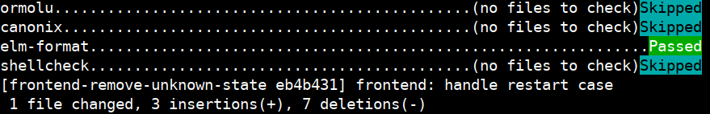

# Seamless integration of [pre-commit](https://pre-commit.com/) git hooks with [Nix](https://nixos.org/nix)



The goal is to **manage commit hooks with Nix** and solve the following:

- **Trivial integration for Nix projects** (wires up a few things behind the scenes)

- Provide a low-overhead build of all the tooling available for the hooks to use
   (naive implementation of calling nix-shell does bring some latency when committing)

- **Common hooks for languages** like Python, Haskell, Elm, etc.

- Run hooks **as part of development** and **on your CI**

# Getting started

## devenv.sh

https://devenv.sh/pre-commit-hooks/

## Nix

1. (optional) Use binary caches to avoid compilation:

   ```bash
   nix-env -iA cachix -f https://cachix.org/api/v1/install
   cachix use pre-commit-hooks
   ```

2. Integrate hooks to be built as part of `default.nix`:

   ```nix
    let
      nix-pre-commit-hooks = import (builtins.fetchTarball "https://github.com/cachix/pre-commit-hooks.nix/tarball/master");
    in {
      # Configured with the module options defined in `modules/pre-commit.nix`:
      pre-commit-check = nix-pre-commit-hooks.run {
        src = ./.;
        # If your hooks are intrusive, avoid running on each commit with a default_states like this:
        # default_stages = ["manual" "push"];
        hooks = {
          elm-format.enable = true;
          ormolu.enable = true;
          shellcheck.enable = true;
        };
    
        # Set the pkgs to get the tools for the hooks from. 
        # tools = pkgs; 

        # Some hooks offer custom settings that affect how they execute
        settings = {
          ormolu.defaultExtensions = [ "lhs" "hs" ];
        };
      };
    }
   ```

   Run `$ nix-build -A pre-commit-check` to perform the checks as a Nix derivation.

3. Integrate hooks to prepare environment as part of `shell.nix`:

   ```nix
    (import <nixpkgs> {}).mkShell {
       shellHook = ''
        ${(import ./default.nix).pre-commit-check.shellHook}
      '';
    }
   ```

   Add `/.pre-commit-config.yaml` to `.gitignore`.

   Run `$ nix-shell` to execute `shellHook` which will:

   - build the tools and `.pre-commit-config.yaml` config file symlink which
     references the binaries, for speed and safe garbage collection
   - provide the `pre-commit` executable that `git commit` will invoke

## Optional

### Direnv

`.envrc`:

```
use nix
```

# Hooks

## Nix

- [alejandra](https://github.com/kamadorueda/alejandra)
- [deadnix](https://github.com/astro/deadnix)
- [nil](https://github.com/oxalica/nil)
- [nixpkgs-fmt](https://github.com/nix-community/nixpkgs-fmt)
- [nixfmt](https://github.com/serokell/nixfmt/)
- [statix](https://github.com/nerdypepper/statix)

## Haskell

- [ormolu](https://github.com/tweag/ormolu)
- [fourmolu](https://github.com/parsonsmatt/fourmolu)
- [hindent](https://github.com/chrisdone/hindent)
- [stylish-haskell](https://github.com/jaspervdj/stylish-haskell)
- [hlint](https://github.com/ndmitchell/hlint)
- [cabal-fmt](https://github.com/phadej/cabal-fmt)
- [hpack](https://github.com/sol/hpack)

#  C/C++/C#/ObjC

- [clang-format](https://clang.llvm.org/docs/ClangFormat.html)
- [clang-tidy](https://clang.llvm.org/extra/clang-tidy/)

## Clojure

- [cljfmt](https://github.com/weavejester/cljfmt)
- [zprint](https://github.com/kkinnear/zprint)

## Elm

- [elm-format](https://github.com/avh4/elm-format)
- [elm-review](https://github.com/jfmengels/elm-review)
- [elm-test](https://github.com/rtfeldman/node-test-runner)

## Elixir

- [mix-format](https://hexdocs.pm/mix/main/Mix.Tasks.Format.html)
- [mix-test](https://hexdocs.pm/mix/1.13/Mix.Tasks.Test.html)
- [credo](https://github.com/rrrene/credo)
- [dialyzer](https://github.com/jeremyjh/dialyxir)

## OCaml

- [dune-fmt](https://dune.build/)
- [dune-opam-sync](https://dune.build/)
- [opam-lint](https://opam.ocaml.org/)
- [ocp-indent](http://www.typerex.org/ocp-indent.html)

## Purescript

- [purty](https://gitlab.com/joneshf/purty)

## JavaScript/TypeScript

- denofmt: Runs `deno fmt`
- denolint: Runs `deno lint`
- [eslint](https://github.com/eslint/eslint)
- [rome](https://github.com/rome/tools)

## Python

- [autoflake](https://github.com/PyCQA/autoflake)
- [black](https://github.com/psf/black)
- [ruff](https://github.com/charliermarsh/ruff)
- [isort](https://github.com/PyCQA/isort)
- [mypy](https://github.com/python/mypy)
- [pyright](https://github.com/microsoft/pyright)
- [pyupgrade](https://github.com/asottile/pyupgrade)
- [pylint](https://github.com/PyCQA/pylint)
- [flake8](https://github.com/PyCQA/flake8)

## PHP

- [php-cs-fixer](https://github.com/PHP-CS-Fixer/PHP-CS-Fixer)
- [phpcbf](https://github.com/squizlabs/PHP_CodeSniffer)
- [phpcs](https://github.com/squizlabs/PHP_CodeSniffer)
- [phpstan](https://github.com/phpstan/phpstan)
- [psalm](https://github.com/vimeo/psalm)

## Rust

- [rustfmt](https://github.com/rust-lang/rustfmt)
- [clippy](https://github.com/rust-lang/rust-clippy)
- cargo-check: Runs `cargo check`

## Golang

- gofmt: Runs `go fmt`
- gotest: Runs `go test`
- [golangci-lint](https://golangci-lint.run/)
- [govet](https://pkg.go.dev/cmd/vet)
- [revive](https://github.com/mgechev/revive)
- [staticcheck](https://github.com/dominikh/go-tools)

## Julia

- [JuiaFormatter.jl](https://github.com/domluna/JuliaFormatter.jl)

## Shell

- [shellcheck](https://github.com/koalaman/shellcheck)
- [shfmt](https://github.com/mvdan/sh)
- [beautysh](https://github.com/lovesegfault/beautysh)
- [bats](https://github.com/bats-core/bats-core)

## LaTeX

- [chktex](https://www.nongnu.org/chktex/)
- [latexindent](https://github.com/cmhughes/latexindent.pl)

## Lua

- [luacheck](https://github.com/mpeterv/luacheck)
- [stylua](https://github.com/JohnnyMorganz/StyLua)
- [lua-ls](https://github.com/LuaLS/lua-language-server)

## HTML

- [html-tidy](https://github.com/htacg/tidy-html5)

## Markdown

- [markdownlint](https://github.com/DavidAnson/markdownlint)
- [mdsh](https://zimbatm.github.io/mdsh/)

## Terraform

- `terraform-format`: built-in formatter
- [tflint](https://github.com/terraform-linters/tflint)

## YAML

- [yamllint](https://github.com/adrienverge/yamllint)

## TOML

- [taplo fmt](https://github.com/tamasfe/taplo)

## Typst

- [typstfmt](https://github.com/astrale-sharp/typstfmt)

## Fortran

- [fprettify](https://github.com/pseewald/fprettify)

## Spell checkers

- [hunspell](https://github.com/hunspell/hunspell)
- [typos](https://github.com/crate-ci/typos)
- [cspell](https://cspell.org/)

## Other Formatters

- [prettier](https://prettier.io)
- `dhall format`: built-in formatter
- [hadolint](https://github.com/hadolint/hadolint)
- [editorconfig-checker](https://github.com/editorconfig-checker/editorconfig-checker)
- [actionlint](https://github.com/rhysd/actionlint)
- [tagref](https://github.com/stepchowfun/tagref)
- [treefmt](https://github.com/numtide/treefmt)
- [topiary](https://github.com/tweag/topiary)
- [checkmake](https://github.com/mrtazz/checkmake)
- [mkdocs-linkcheck](https://github.com/byrnereese/linkchecker-mkdocs)
- [headache](https://github.com/frama-c/headache)
- [crystal](https://crystal-lang.org/reference/man/crystal#crystal-tool-format)
- [cmake-format](https://cmake-format.readthedocs.io/en/latest/)

You may restrict which languages should be formatted by `clang-format` using
`clang-format.types_or`. For example to check only C and C++ files:

```nix
clang-format = {
  enable = true;
  types_or = lib.mkForce [ "c" "c++" ];
};
```

Otherwise, the default internal list is used which includes everything that 
clang-format supports.

## Git

- [commitizen](https://github.com/commitizen-tools/commitizen)
- [gptcommit](https://github.com/zurawiki/gptcommit)
- [convco](https://github.com/convco/convco)
- [annex](https://git-annex.branchable.com/)

## Custom hooks

Sometimes it is useful to add a project specific command as an extra check that
is not part of the pre-defined set of hooks provided by this project.

Example configuration:

```nix
 let
   nix-pre-commit-hooks = import (builtins.fetchTarball "https://github.com/cachix/pre-commit-hooks.nix/tarball/master");
 in {
   pre-commit-check = nix-pre-commit-hooks.run {
     hooks = {
       # ...

       # Example custom hook for a C project using Make:
       unit-tests = {
         enable = true;

         # The name of the hook (appears on the report table):
         name = "Unit tests";

         # The command to execute (mandatory):
         entry = "make check";

         # The pattern of files to run on (default: "" (all))
         # see also https://pre-commit.com/#hooks-files
         files = "\\.(c|h)$";

         # List of file types to run on (default: [ "file" ] (all files))
         # see also https://pre-commit.com/#filtering-files-with-types
         # You probably only need to specify one of `files` or `types`:
         types = [ "text" "c" ];

         # Exclude files that were matched by these patterns (default: [ ] (none)):
         excludes = [ "irrelevant\\.c" ];

         # The language of the hook - tells pre-commit
         # how to install the hook (default: "system")
         # see also https://pre-commit.com/#supported-languages
         language = "system";

         # Set this to false to not pass the changed files
         # to the command (default: true):
         pass_filenames = false;
       };
     };
   };
 }
```

Custom hooks are defined with the same schema as [pre-defined
hooks](modules/pre-commit.nix).

# Nix Flakes support

Given the following `flake.nix` example:

```nix
{
  description = "An example project.";

  inputs.pre-commit-hooks.url = "github:cachix/pre-commit-hooks.nix";
  inputs.flake-utils.url = "github:numtide/flake-utils";

  outputs = { self, nixpkgs, pre-commit-hooks, flake-utils }:
    flake-utils.lib.eachDefaultSystem (system:
      {
        checks = {
          pre-commit-check = pre-commit-hooks.lib.${system}.run {
            src = ./.;
            hooks = {
              nixpkgs-fmt.enable = true;
            };
          };
        };
        devShell = nixpkgs.legacyPackages.${system}.mkShell {
          inherit (self.checks.${system}.pre-commit-check) shellHook;
        };
      }
    );
}
```

Add `/.pre-commit-config.yaml` to the `.gitignore`.

To run the all the hooks on CI:

```bash
nix flake check
```

To install pre-commit hooks developers would run:

```bash
nix develop
```

# Contributing hooks

Everyone is encouraged to add new hooks.

<!-- TODO generate option docs -->
Have a look at the [existing hooks](modules/hooks.nix) and the [options](modules/pre-commit.nix).

There's no guarantee the hook will be accepted, but the general guidelines are:

- Nix closure of the tool should be small e.g. `< 50MB`. A problematic example:
```
   $ du -sh $(nix-build -A go)
   463M	/nix/store/v4ys4lrjngf62lvvrdbs7r9kbxh9nqaa-go-1.18.6
```
- The tool must not be very specific (e.g. language tooling is OK, but project specific tooling is not)
- The tool needs to live in a separate repository (even if a simple bash script, unless it's a oneliner)
