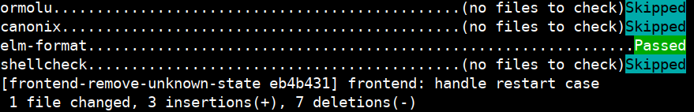

# Seamless integration of [git hooks](https://pre-commit.com/) with [Nix](https://nixos.org/nix)



## Features

- **Trivial integration for Nix projects** (wires up a few things behind the scenes)

- Provide a low-overhead build of all the tooling available for the hooks to use
  (naive implementation of calling nix-shell does bring some latency when committing)

- **Common hooks for languages** like Python, Haskell, Elm, etc. [See all hook options](https://devenv.sh/?q=git-hooks.hooks)

- Run hooks **as part of development** and **during CI**

- Support for alternative `pre-commit` implementations, like [prek](https://github.com/j178/prek).

## Getting started

### devenv.sh

```nix
{ inputs, ... }:

{
  git-hooks.hooks = {
    # Format Nix code
    nixfmt.enable = true;

    # Format Python code
    black.enable = true;

    # Lint shell scripts
    shellcheck.enable = true;

    # Execute shell examples in Markdown files
    mdsh.enable = true;

    # Override a package with a different version
    ormolu.enable = true;
    ormolu.package = pkgs.haskellPackages.ormolu;

    # Some hooks have more than one package, like clippy:
    clippy.enable = true;
    clippy.packageOverrides.cargo = pkgs.cargo;
    clippy.packageOverrides.clippy = pkgs.clippy;
    # Some hooks provide settings
    clippy.settings.allFeatures = true;

    # Define your own custom hooks
    # See all options: https://github.com/cachix/git-hooks.nix#custom-hooks
    my-custom-hook = {
      enable = true;
      entry = "./on-pre-commit.sh";
    };
  };

  # Use alternative pre-commit implementations
  git-hooks.package = pkgs.prek;
}
```

See [getting started](https://devenv.sh/getting-started/).

## Flakes support

Given the following `flake.nix` example:

```nix
{
  description = "An example project";

  inputs = {
    systems.url = "github:nix-systems/default";
    git-hooks.url = "github:cachix/git-hooks.nix";
  };

  outputs =
    {
      self,
      systems,
      nixpkgs,
      ...
    }@inputs:
    let
      forEachSystem = nixpkgs.lib.genAttrs (import systems);
    in
    {
      # Run the hooks with `nix fmt`.
      formatter = forEachSystem (
        system:
        let
          pkgs = nixpkgs.legacyPackages.${system};
          config = self.checks.${system}.pre-commit-check.config;
          inherit (config) package configFile;
          script = ''
            ${pkgs.lib.getExe package} run --all-files --config ${configFile}
          '';
        in
        pkgs.writeShellScriptBin "pre-commit-run" script
      );

      # Run the hooks in a sandbox with `nix flake check`.
      # Read-only filesystem and no internet access.
      checks = forEachSystem (system: {
        pre-commit-check = inputs.git-hooks.lib.${system}.run {
          src = ./.;
          hooks = {
            nixfmt.enable = true;
          };
        };
      });

      # Enter a development shell with `nix develop`.
      # The hooks will be installed automatically.
      # Or run pre-commit manually with `nix develop -c pre-commit run --all-files`
      devShells = forEachSystem (system: {
        default =
          let
            pkgs = nixpkgs.legacyPackages.${system};
            inherit (self.checks.${system}.pre-commit-check) shellHook enabledPackages;
          in
          pkgs.mkShell {
            inherit shellHook;
            buildInputs = enabledPackages;
          };
      });
    };
}
```

Add `/.pre-commit-config.yaml` to `.gitignore`.
This file is auto-generated from the Nix configuration and doesn't need to be committed.

Enter a development shell with pre-commit hooks enabled:

```shell
nix develop
```

Run all hooks sandboxed:

```shell
nix flake check
```

Keep in mind that `nix flake check` runs in a sandbox.
It doesn't have access to the internet and cannot modify files.
This makes it a poor choice for formatting hooks that attempt to fix files automatically, or hooks that cannot easily be packaged to avoid impure access to the internet.

A better alternative in such cases is to run `pre-commit` through `nix develop`:

```shell
nix develop -c pre-commit run -a
```

Or configure a `formatter` like in the example above and use `nix fmt`:

```shell
nix fmt
```

### flake-follows

The `flake-follows` hook keeps `flake.nix` inputs tidy by running `flake-edit follow` to add missing `follows` declarations.

```nix
{
  hooks.flake-follows.enable = true;
}
```

Because `flake-follows` may update `flake.nix`, run it from a development shell rather than relying on `nix flake check`:

```shell
nix develop -c pre-commit run flake-follows --all-files
```

By default, the hook passes `--no-lock` to avoid updating `flake.lock`.
Set `hooks.flake-follows.settings.noLock = false` if you want `flake-edit` to update the lock file too.

### flake-parts

If your flake uses [flake-parts](https://flake.parts/), we provide a flake-parts module as well. Checkout [`./template/flake.nix`](https://github.com/cachix/git-hooks.nix/blob/master/template/flake.nix) for an example.

## Nix

1. **Optionally** use binary caches to avoid compilation:

   ```sh
   nix-env -iA cachix -f https://cachix.org/api/v1/install
   cachix use pre-commit-hooks
   ```

1. Integrate hooks to be built as part of `default.nix`:

   ```nix
    let
      nix-pre-commit-hooks = import (builtins.fetchTarball "https://github.com/cachix/git-hooks.nix/tarball/master");
    in {
      # Configured with the module options defined in `modules/pre-commit.nix`:
      pre-commit-check = nix-pre-commit-hooks.run {
        src = ./.;
        # If your hooks are intrusive, avoid running on each commit with a default_states like this:
        # default_stages = ["manual" "pre-push"];
        hooks = {
          elm-format.enable = true;

          # override a package with a different version
          ormolu.enable = true;
          ormolu.package = pkgs.haskellPackages.ormolu;
          ormolu.settings.defaultExtensions = [ "lhs" "hs" ];

          # some hooks have more than one package, like clippy:
          clippy.enable = true;
          clippy.packageOverrides.cargo = pkgs.cargo;
          clippy.packageOverrides.clippy = tools.clippy;
          # some hooks provide settings
          clippy.settings.allFeatures = true;
        };
      };
    }
   ```

   Run `$ nix-build -A pre-commit-check` to perform the checks as a Nix derivation.

1. Integrate hooks to prepare environment as part of `shell.nix`:

   ```nix
    let
      pre-commit = import ./default.nix;
    in (import <nixpkgs> {}).mkShell {
      shellHook = ''
        ${pre-commit.pre-commit-check.shellHook}
      '';
      buildInputs = pre-commit.pre-commit-check.enabledPackages;
    }
   ```
